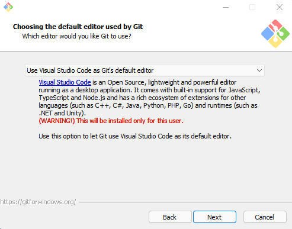
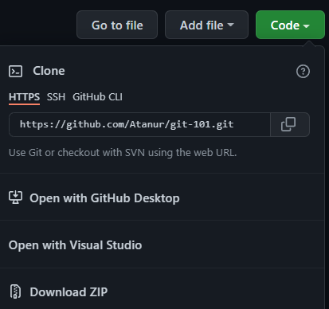

<h1 align="center">Git Basics</h1>
<p align="center">Github'a yeni başlayanlar ya da bilgilerini tazelemek isteyenler için temel kavramları ele aldığım bu yazıda <b>git-scm</b> ve <b>Github</b> kullanımı hakkında genel bilgileri edinebilirsiniz.</p>

---

<dl>
<dt align="center" id="vcs">Version Control System (VCS) nedir?</dt>
<dd>Oluşturduğunuz dosyadaki değişiklikleri kaydedip daha sonra geri çağırabilmenizi sağlayan bir sistemdir. Bu sistem, aktif çalışan sistemlerin üstünde geliştirme yapabilmenizi sağlarken, aynı zamanda oluşan sorunların da kolay yoldan çözülebilmesine olanak sağlar. </dd>
<dt align="center" id="git">Git (git-scm) nedir?</dt>
<dd>Git bir paylaşımlı versiyon kontrol sistemidir (Distributed Version Control System). Projeyle ilgili gelişmeleri birçok kişi arasında kontrol altına almak ve yapılan tüm değişiklikleri izlemek için kullanılan ücretsiz ve açık kaynak kodlu bir sistemdir. Standart bir VCSden farkı projenin tüm sürümlerini depolamak için merkezi bir sunucuya güvenmek yerine, her geliştirici projenin bir kopyasını kendi sabit diskinde saklar. Buna klonlama denir. Bu klonlar projenin meta verilerini barındırmazken orjinal dosya sabit bir sunucuda veya Github gibi bulut tabanlı hizmetlerde barındırılabilir.</dd>
<dt align="center" id="why">Neden Git kullanmalıyız?</dt>
<dd>Projenizi sabit bir diskte barındırırken bir problemle karşılaştığınızda çözüm üretmek nerdeyse imkansızdır. Bu durumlar için projenizi düzenli olarak yedekleme ihtiyacı duyabilirsiniz ama projeniz büyür ve ekibiniz genişler, sonuç olarak artık yedeklenemeyecek boyutlara gelirse ne olucak? İşte bu durumlar için Projenin başında doğru kararı vermek çok önemlidir. Git bu gibi durumlarda sizin başınızı büyük bir beladan kuratabilir çünkü verileri kaydetme aşamasında sizin taleplerinizi dinler ve gerekli dosyaları yedeklemenize olanak sağlar. bunun yanı sıra hiç bir ortak ağa bağlı kalmadan geliştirme yapabilmenize yardımcı olur. son olarak git, takımların eş zamanlı geliştirme yapmasında kolaylık sağlar.</dd>
</dl>

---

<h3 id="installation">Git kurulumu</h3>
<p>Giti bilgisayarınıza <a href="https://git-scm.com/downloads" target="_blank">bu linkten</a>   indirebilirsiniz. İndirme işlemi sırasında dikkat etmeniz gereken tek şey, eğer vscode kullanıyorsanız, aşağıda gördüğünüz gibi vscode'u gitin varsayılan editörü olarak seçin.</p>


---

<h3 id="after-installation">Giti kurdum, sırada ne var?</h3>
<p>Git'i bilgisayarınıza kurduktan sonra ilk yapmanız gereken giti kendi kişisel bilginize göre yapılandırmanızdır. Bu ne anlama geliyor dicek olursanız; Önceden bahsettiğim gibi git, paylaşımlı bir versiyon kontrol sistemidir. birden fazla kişiyle bir projede uğraşırken git'in içindeki kimlik bilgileriniz sizi diğer kişilerden ayırt etmek için kullanılır. bunlar email adresi ve görünen isiminizdir. bunları konfigüre etmek için bilgisayarınızın komut satırına </p>

```
git config --global user.name {kullanıcı isiminiz}
git config --global user.email {email adresiniz}
```

<p>yazmanız yeterli olucaktır. bu aşamadan sonra artık git'i gerek çevrim için gerekse çevrımdışı olarak kullanmaya hazırsınız.</p>

---

<h3 id="commands">Git komutları</h3>
<p>Git, VCS işlemlerinizi kolaylaştırmak için belirli komutlar oluşturmuş ve bu komutlar sayesinde git'i daha aktif şekilde kullanmanıza olanak sağlamıştır.</p>

| Komutlar                              | Örnek Kod                                |
| ------------------------------------- | ---------------------------------------- |
| <a href="#config">Git config </a>     | `git config --global user.name "name"`   |
| <a href="#config" >Git init </a>      | `git init "repository name"`             |
| <a href="#clone">Git clone </a>       | `git clone "repository url"`             |
| <a href="#add">Git add </a>           | `git add "folder/file"`                  |
| <a href="#commit">Git commit </a>     | `git commit -m "message"`                |
| <a href="#revert">Git revert </a>     | `git revert HEAD`                        |
| <a href="#diff">Git diff </a>         | `git diff`                               |
| <a href="#push">Git push </a>         | `git push`                               |
| <a href="#branch">Git branch </a>     | `git branch`                             |
| <a href="#checkout">Git checkout </a> | `git checkout "branch name"`             |
| <a href="#merge">Git merge </a>       | `git merge "branch name"`                |
| <a href="#fetch">Git fetch </a>       | `git fetch`                              |
| <a href="#pull">Git pull </a>         | `git pull`                               |
| <a href="#log">Git log </a>           | `git log`                                |
| <a href="#show">Git show </a>         | `git show "commit id"`                   |
| <a href="#reset">Git reset </a>       | `git reset --hard "commit id" `          |
| <a href="#stash">Git stash </a>       | `git stash`                              |
| <a href="#rm">Git rm </a>             | `git rm "branch name"`                   |
| <a href="#remote">Git remote </a>     | `git remote add origin "reposiroty url"` |
| <a href="#tag">Git tag </a>           | `git tag "commit id"`                    |

---

<h3 id="config">Git config</h3>
<p>önceden bahsettiğim gibi kimlik bilgilerinizin ve git'in diğer yapılandırma ayarlarını ayarladığınız komuttur.</p>

---

<h3 id="init">Git init</h3>
<p>Yeni bir proje oluşturduğunuzda projenin yapısını git'e bağlamak için kullandığımız komuttur.</p>

---

<h3 id="clone">Git clone</h3>
<p>Yeni bir proje oluşturduğunuzda projenin yapısını git'e bağlamak için kullandığımız komuttur.</p>

<p>yukarıda gördüğünüz gibi "HTTPS" tipindeki url ile kolayca clone alabilirsiniz. </p>

---

<h3 id="add">Git add</h3>
<p>Projenizdeki değişiklikleri git'e eklemek için kullandığımız add komutu 2 farklı biçimde çalışırtırılabilir.</p>
<dl>
<dt>1.Yöntem</dt>
<dd>Yapılan değişiklerin sadece bir kısmını git'e eklemek istiyorsanız

`git add [file/folder]`
kullanabilirsiniz. bu komut yalnızca seçilen dosyaların veya klasörlerin eklenmesini sağlıcaktır.

</dd>
<dt>2.Yöntem</dt>
<dd>Yapılan değişiklerin tümünü git'e eklemek istiyorsanız

`git add .`
kullanabilirsiniz. burdaki "." ifadesi varsayılan dosyayı ve alt klasörlerini kapsamaktadır.

</dd>
</dl>

---

<h3 id="commit">Git commit</h3>
<p>Projenizdeki değişiklikleri add ile ekledikten sonra sürüm geçmişinde kalıcı olarak kaydetmek için commit komutunu kullanırız.</p>
<dl>
<dt>1.Yöntem</dt>
<dd>Yapılan değişiklerin bir mesaj ile eklemek için

`git commit -m "message"`
kullanabilirsiniz. burdaki "-m" ifadesi commit'in tipinin bir message olduğunu tanımlar.

</dd>
<dt>2.Yöntem</dt>
<dd>her defasında hem git add hem de git commit yapmak yerine

`git commit -am "message"`
kullanabilirsiniz. bu komut bir taşla iki kuş vurmanızı sağlıcaktır.

</dd>
</dl>

---

<h3 id="revert">Git revert</h3>
<p>Commit attıktan sonra kodu <a href="#head">Head</a> öncesi haline döndürmek için

`git revert HEAD`
kullanılır.

</p>

---

<h3 id="diff">Git diff</h3>
<p>Commitlenmiş localdeki dosyalar ile uzak sunucudaki  farklılıkları gösterir.</p>

---

<h3 id="push">Git push</h3>
<p>Yapılan local değişiklikleri uzaktaki sunucuya gönderir.</p>

---

<h3 id="branch">Git branch</h3>
<p>Türkçesi "dal/şube" anlamına gelen branch mantığı git'in en önemli yapılarından biridir. burda işlem var olan bir yapıyı kopyalayıp yeni bir dalda yürütmeyi sağlar. </p>
<dl>
<dt>1.Yöntem</dt>
<dd>uzak sunucudaki  tüm dalları görmek için

`git branch`
kullanabilirsiniz.

</dd>
<dt>2.Yöntem</dt>
<dd>uzak sunucuda yeni bir dal oluşturmak için

`git branch "branch name"`
kullanabilirsiniz.

</dd>
</dl>

---

<h3 id="checkout">Git checkout</h3>
<p>Bir daldan diğer dala geçiş yapmanızı sağlar.</p>

---

<h3 id="merge">Git merge</h3>
<p>Aktif olan dalın <a>Head</a> durumunu belirtilen dala aktarır.</p>

---

<h3 id="fetch">Git fetch</h3>
<p>Uzak sunucudaki değişiklikleri localdeki projeyle karşılaştırır herhangi bir dosya aktarımı yapmaz.</p>

---

<h3 id="pull">Git pull</h3>
<p>Fetch'in aksine uzak sunucudaki değişiklikleri localdeki projeyle birleştirir veya dosyaları aktarır.</p>

---

<h3 id="show">Git show</h3>
<p>Tüm meta verilerin ve yapılan değişikleri gösterir</p>
<dl>
<dt>1.Yöntem</dt>
<dd>Tüm değişiklikleri görmek için

`git show`
kullanabilirsiniz.

</dd>
<dt>2.Yöntem</dt>
<dd>Seçilen committe yapılan değişikliği görmek için comit'in idsi ile

`git show "commit id"`
kullanabilirsiniz.

</dd>
</dl>

---

<h3 id="reset">Git reset</h3>
<p><a>Head</a>'i sıfırlamamızı sağlar. bu ne anlama gelir dicek iseniz; <a>Head</a>'e kadar olan tüm commitleri kaldırır diyebiliriz. Peki ama bunu neden yapalım? Bunun aslında bir çok açıklaması var ama en bariz örnek yapılan yanlış bir commit'in önüne geçmek diyebiliriz. Son olarak bu reset işlemini yapmanın 3 farklı yol var</p>
<dl>
<dt>1.Yöntem</dt>
<dd>Soft komutu ile kullanmak; Seçilen commit ve sonrasındaki commitleri git'e yeni eklenmiş ama henüz commit yapılmamış hale getirmek için

`git reset --soft "commit id"`
kullanabilirsiniz.

</dd>
<dt>2.Yöntem</dt>
<dd>Mixed komutu ile kullanmak; Soft komutuna benzer olup tek farkı yaplan değişiklikleri git'e henüz eklememiş olmasıdır. Yani
henüz add ve commit işlemi yap yapılmamış hale getirmek için

`git reset --mixed "commit id"`
kullanabilirsiniz.

</dd>
<dt>3.Yöntem</dt>
<dd>Hard komutu ile kullanmak; Diğer 2 komuta benzer olup en büyük farkı yapılan değişikleri geri almasıdır. Bu işlem sonrasında ortada ne kod kalır ne de commit... Bunun için

`git reset --hard "commit id"`
kullanabilirsiniz.

</dd>
</dl>

---

<h3 id="stash">Git stash</h3>

<p>Commit yapısına benzer olup arka planda stack yapısını barındırır. Bir çok kullanım alanı da mevcuttur. Commit çöplüğünü önlemek, ortak projelerde kayıpsız ilerlemek ve günlük çalışmaları kayıt altına almak bu yapının kullanım amacına örnek verilebilir. Aynı zamanda stashler, büyük projeler için ileriye dönük bir yatırımdır. Peki stash yapısı nasıl çalışır?  </p>

<dl>
<dt>Stash list</dt>
<dd>List komutu ile kayıt altına aldığınız değişiklikleri görebilirsiniz.

`git stash list`

</dd>
<dt>Stash push</dt>
<dd>Yapılan değişiklikleri stashimize kaydetmek için.

`git stash push "message"`
kullanırız

</dd>
<dt>Stash show</dt>
<dd>Yapılan değişiklikleri görüntülemek için.

`git stash show -p "stash id"`
kullanırız

</dd>
<dt>Stash pop</dt>
<dd>Yapılan değişikliği stashten geri almak için

`git stash pop "stash id"`
kullanılır

</dd>

<dt>Stash apply</dt>
<dd>Pop yapısına benzer fakat yapılan değişikleri geri alırken stashten silmez. Silmeden geri almak için

`git stash apply "stash id"`
kullanılır

</dd>
<dt>Stash drop</dt>
<dd>Yapılan değişikliği silmek için

`git stash drop "stash id"`
kullanırız

</dd>
</dl>

---

<h3 id="rm">Git rm</h3>
<p> Git rm, Seçilen dosyayı ve ya klasörü git üzerinden siler.</p>

---

<h3 id="remote">Git remote</h3>
<p>Localde oluşturduğunuz projeyi uzak bir sunucuya bağlamak için kullanılır</p>

<p>Yukarıda gördüğünüz gibi "HTTPS" tipindeki url ile kolayca remote edebilirsiniz. </p>

---

<h3 id="tag">Git tag</h3>
<p>Belirtilen commit'e etiket vermek için kullanılır. Bu işlem projenin versiyonlama işlemleri için uygundur. Belirli commitlere tag verip versiyon takibini yapmanızı sağlar. Bir commit'i etiketlemek için

`git tag -a v1.3 "commit id"`
kullanabilirsiniz</p>

---

<h3 id="head">Git Head nedir?</h3>
<p>Yapılan son commit'e projenin head'i denir. gitin üzerinde çoğu işlem Head üzerinden yapılır.</p>

---
